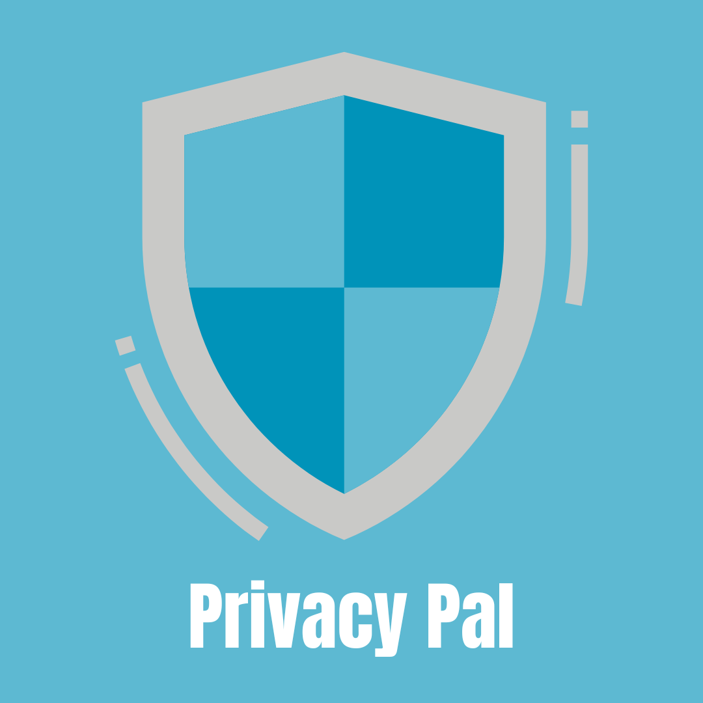

# Privacy Pal

## Development Setup

1. Clone this repo from Github

        $ git clone https://github.com/NikhilSuresh24/cs-239-data-privacy.git

2. Install the required packages with npm

        $ cd privacy-pal & npm install

3. Build the extension

        $ npm run build

4. Click on the extensions button on Chrome -> Manage Extensions

5. Turn on Developer Mode and click `Load Unpacked`

6. Navigate to the `dist` directory inside `privacy-pal` and select it

You can now see the extension on chrome!! To make any changes, follow the following developer workflow:

    a. Make any changes
    b. npm run build
    c. Open extensions page on Chrome and click reload button on Privacy Pal Extension
    d. Test!

### Optional (Linting Setup)

TBD

